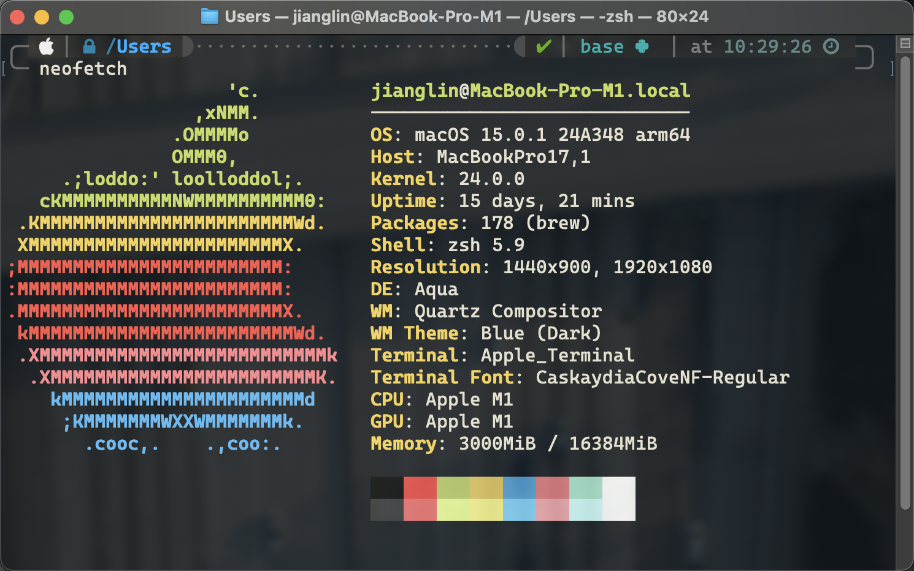

## 1. 引言

> ~~人类的本质就是颜狗~~ **美丽的事物可以提升生产力**。

最近入手了新的 Mac Mini M4，新机新气象，初始化工作就从终端美化开始吧。

## 2. 总览

本次美化先从系统自带的 **Terminal** 入手，其他的终端工具如 **iTerm** 等优化方式差异不大。

主要使用：

- **zsh** 默认 shell
- **oh-my-zsh** zsh 的增强
- **Powerlevel10k** 主题
- **ayu** 配色
- **Cascadia Code NF** 字体

最终效果如下：



## 3. 配置

### 3.1 安装 zsh 与 oh-my-zsh

此处假设已经安装了 [homebrew](https://brew.sh/)。

安装 zsh 的命令十分简单，考虑还要安装 **oh-my-zsh**，所以一起安装 **Git**。

```bash
brew install zsh git
```

接下来从 [oh-my-zsh](https://ohmyz.sh/) 的官网获取安装命令。

```bash
sh -c "$(curl -fsSL https://raw.githubusercontent.com/ohmyzsh/ohmyzsh/master/tools/install.sh)"
```

### 3.2 安装字体

为了在 Terminal 提供丰富多彩的现实，建议安装 Nerd Font，否则特殊符号无法正常显示。可以在 [Nerd Fonts](https://www.nerdfonts.com/) 中选择喜欢的字体。

作为微软信徒，我选择了微软提供的 [Cascadia Code](https://github.com/microsoft/cascadia-code)，刚好官方提供了 Nerd Font 版本。

### 3.3 安装 Powerlevel10k

默认的 oh-my-zsh 主题比较简陋，推荐使用 [Powerlevel10k](https://github.com/romkatv/powerlevel10k)，提供了基本的自定义功能，可以满足大部分需求。

安装命令如下：

```bash
git clone --depth=1 https://github.com/romkatv/powerlevel10k.git ${ZSH_CUSTOM:-$HOME/.oh-my-zsh/custom}/themes/powerlevel10k
```

修改 `~/.zshrc` 文件，将主题设置为 `Powerlevel10k`。

```bash
ZSH_THEME="powerlevel10k/powerlevel10k"
```

### 3.4 安装配色

在 [iterm2-colors-solarized](https://github.com/mbadolato/iTerm2-Color-Schemes) 中提供了丰富的配色方案。可以选择喜欢的配色单独下载，选择困难症也可以 clone 整个仓库慢慢纠结。

```bash
git clone https://github.com/mbadolato/iTerm2-Color-Schemes.git
```

`terminal` 目录下提供了 Terminal 的配色方案。

`schemes` 目录下提供了 iTerm 的配色方案。

我选择的是 ayu 配色，调整了透明度为 80%，模糊度为 20%。

## 4. 总结

至此配置结束，整个过程不算复杂，基本上十分钟左右可以配置结束。

为了尽快能够让新电脑提供生产力，本次美化还是选择了最熟悉的方案，尽量保证原有的开发习惯。

近年也涌现出一批优秀有趣的终端工具，如 [WezTerm](https://wezfurlong.org/wezterm/)，[Starship](https://starship.rs/)，[Kitty](https://sw.kovidgoyal.net/kitty/)，等有时间的话再慢慢尝试了。