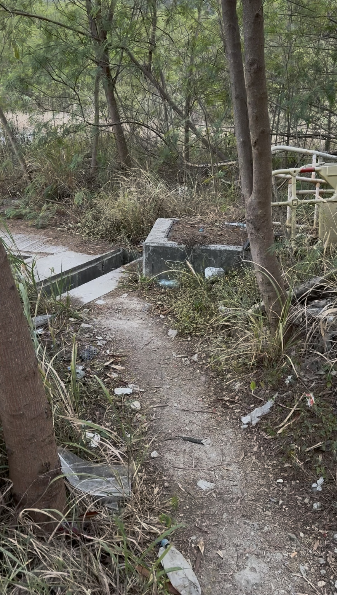
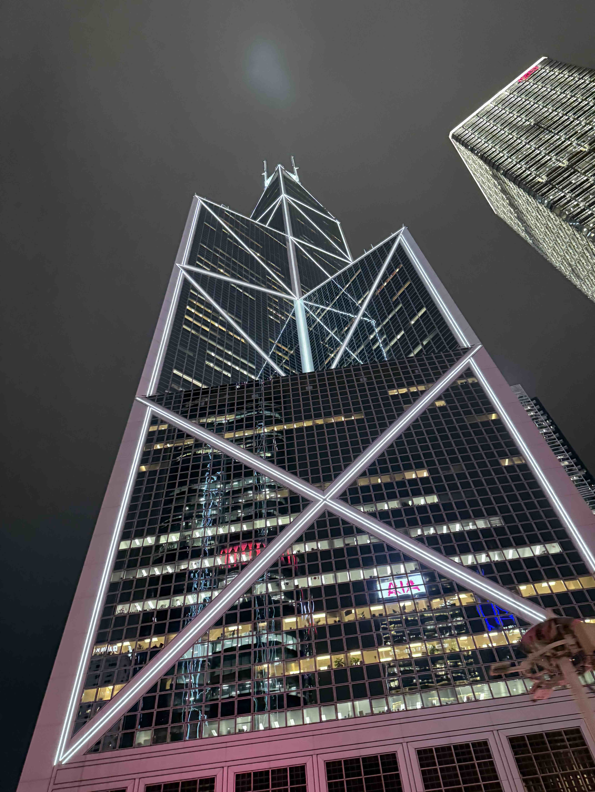

## 1. 简介

这次香港之行，除了 City Walk 与 Disney Land 之外，很重要的事情，是与世界 500 强企业（中银香港）的员工，聊了聊投资（出示投资记录），聊了聊创业（要不要在香港开公司），当然这一切的一切，都是为了开一个中银香港的账户（就是开户的问题啦）。

> 为什么要开中银香港的账户？

申请中银香港账户的最终要目的，就是**最小化资金出海的损耗**。在有中国银行账户的前提下，向中银香港账户转账可以做到**免手续费**，而且速度相对也比较快。

同汇丰 One 账户一样，中银香港的账户也无管理费与最低存款要求，持有成本极低。

## 2. 开户方式

中银香港只推荐**线上预约开户**。微信搜索「中银香港微服务」服务号，选择「银行服务」→「我要预约」，选择合适的时间与分行即可。

某红书上有人尝试 Walk in 开户成功。但是我个人的经历，下午两点左右，在中环某分行，已经取不到开户的号了。

也可以尝试在 APP 中申请，但是上传证件过程中，备受相机对焦问题的折磨，并且尝试 N 久之后，还是得到了「开户失败」的结果，所以也不推荐。

## 3. 开户流程

### 3.1. 预约开户

**最重要的一步**。微信搜索「中银香港微服务」服务号，选择「银行服务」→「我要预约」。

每日零点放出七个工作日后的号，放号后预约比较容易，在白天基本无号。

（也许是跨年预约的原因，我在预约的时候，没有严格提前七个工作日放出我想要的号，导致我多熬了一宿......）

### 3.2. 抵达分行

按时抵达分行，与银行人员确认预约信息后，在预约柜台开始开户。

我们此行预约了两个号，一个迟到了 5min，另一个早到了 25min，但是都没有排队。

这里还得吐槽一句，从东涌到屯门，那个公交换乘的路线是认真的吗，这真的是常规路线吗？

### 3.3. 填写信息

开户期间，银行人员会要求在 App 上填写个人信息，根据个人情况填写。

如果没有提前下载好 App，连接现场的 Wi-Fi 也可以下载，还会被推荐下载一个 BoC Pay 的 App，也许香港的银行朋友们也有指标要求吧......

### 3.4. 开户询问

银行人员会询问个人情况，比如开户目的、个人工作与收入情况等，如实回答即可。

比如我正在创（shi）业中，主要收入来源都是被动收入（0 - 5000 元挡位），也开户成功了。

（或许我该在我的每篇 blog 下面挂个收款码增加收入了......）

### 3.5. 获取银行卡

如果问及「是否要当场下卡」，果断选「是」。邮寄到内地有丢失风险。

至少半个月了，我的汇丰的卡片还没到......

### 3.6. 激活与入金

拿到卡片后，在 ATM 上存入一笔港币，完成激活与入金。如果卡片不识别，尝试稍等片刻重新插入。

## 4. 注意事项

1. 提前预约是最终要的，至少我其他的途径都没有开户成功，导致我去了两次香港了
2. 有说中银香港态度较差。我预约的是建荣街分行，Google Maps 上只有 1.8 分，但是工作人员的态度超好，这里要给个好评

## 5. 总结

同汇丰一样，强烈建议线下开户，只要预约成功，现场开户十分顺利，全程 30 min 左右。

祝大家开户顺利啦~

## 6. 额外多说一句

作为一个伪·贝聿铭粉丝，提到香港就不得不提到的建筑就是中银大厦。建筑本身体现出了贝聿铭一贯的风格，背后的「风水大战」也十分有趣，感兴趣的小伙伴可以搜搜看。在香港这个风水宝地，「风水」确实是商战的重要一环了，不知道香港的建筑学专业是否有风水的选修课程。

