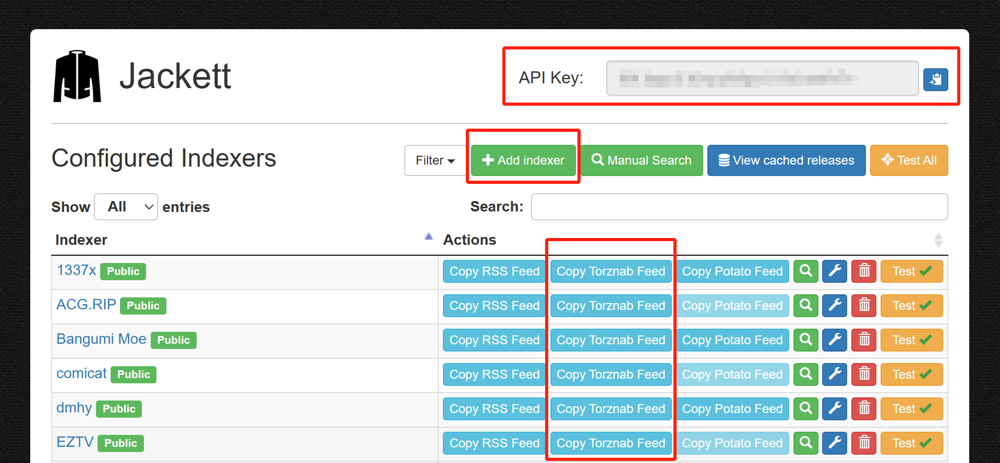
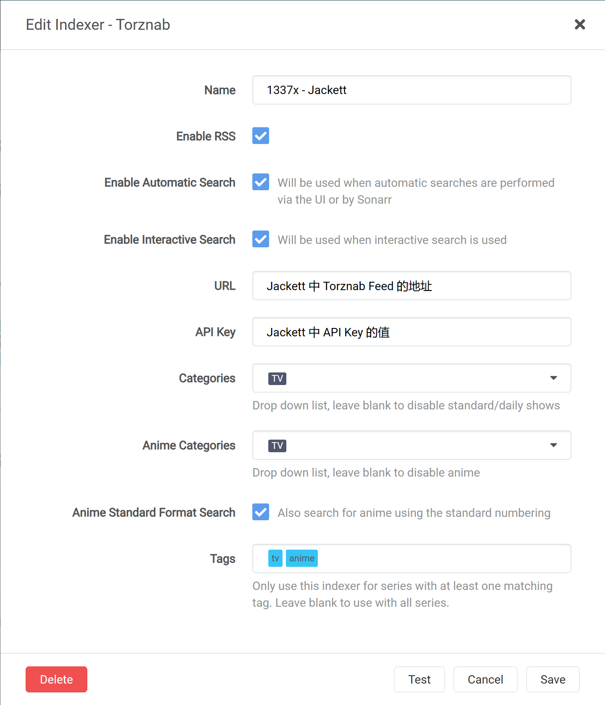
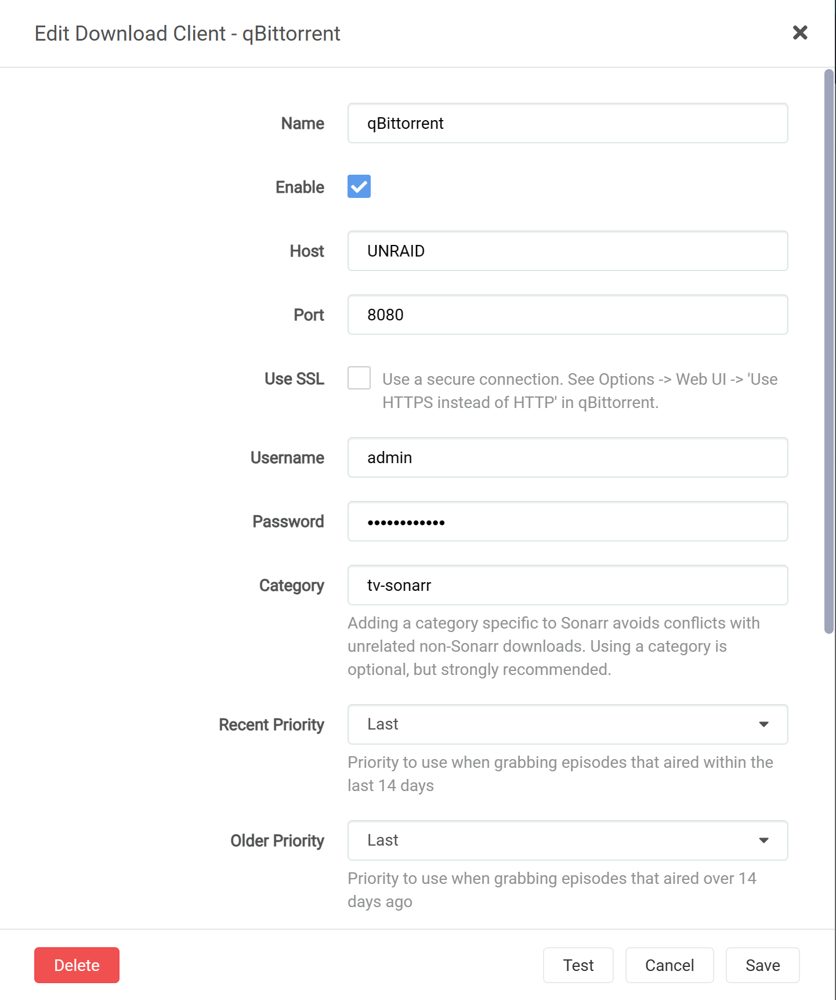
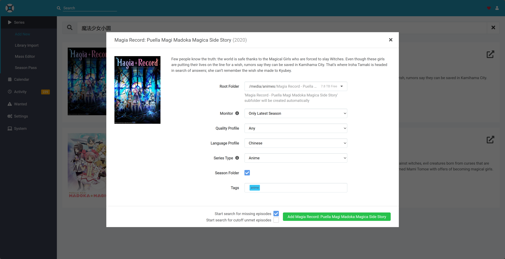

## 背景

为了保证各个年龄段祖国花朵的健康成长，我们在国内的流媒体平台上看到的影视资源都是经过美化的，都有着不亚于新闻联播的祥和画面。然，纵使风景这边独好，有的时候我们依然要带着批判的眼光，去看、去听、去感受外面世界的险恶与残酷，以便解救西方世界的人名群众于水火，实现人类大同的理想......

额咳咳，扯远了。总之，大部分人搭建 NAS 的初衷，可能都是更方便的管理影视剧资源。对于喜欢看动漫的人，可能还希望可以每周同步下载最新的番剧，因此，在这里介绍一套基于 Sonarr 等软件的影音资源管理系统，主要实现了以下功能：

1. 自动下载最新的番剧、电影、电视剧等资源
2. 影视资源的分类管理
3. 搜刮资源信息
4. 多端播放

## 整体架构

### 平台信息

本人使用的是 Unraid 系统，因此接下来都以 Unraid 为例。所有的服务都是使用 Docker 容器的方式运行，对于支持 Docker 的系统，都可以参考本文的配置进行相应的修改。

### 系统组成

- Sonarr：番剧下载管理，支持动漫、电视剧的搜索和下载
- Radarr：电影下载管理，支持电影的搜索和下载
- Overseerr：媒体请求管理，更现代化的 Web 界面
- Jackett：资源搜刮，提供各种资源站点的搜索接口，Sonarr、Radarr 通过它来搜索资源
- （可选）FlareSolverr：解决 Cloudflare 验证问题，提高 Jackett 的资源搜刮成功率
- qBittorrent：下载器
- Plex：媒体服务器
- （可选）JProxy：Sonarr、Radarr 与 Jackett 之间的代理，优化资源匹配结果

## 安装配置

### 安装 Docker

Unraid 系统默认已经安装了 Docker。如果是其他系统或平台，可参考各自的官方文档进行安装，或者参考 [Docker 官方文档](https://docs.docker.com/engine/install/) 进行手动安装。

### 目录准备

为了实现各个服务之间的交互和数据共享，需要提前对可能使用的目录进行规划。以 Unraid 为例，使用到的目录如下：

- /mnt/user/appdata：Docker 容器的配置文件目录，各服务涉及到服务本身的配置，统一扔在这里
- /mnt/user/media/movies：电影媒体库目录
  - Radarr 使用此目录作为**电影**媒体库目录
- /mnt/user/media/tv：电视剧媒体库目录
  - Sonarr 使用此目录作为**影视剧**媒体库目录
- /mnt/user/media/anime：动漫媒体库目录
  - Sonarr 使用此目录作为**动漫**媒体库目录
- /mnt/user/media/downloads：下载目录
  - qBittorrent 使用此目录作为下载目录
  - Sonarr、Radarr 从此目录读取数据，并移动到相应的媒体库目录

如果创建 Docker 服务时以上目录没有自动创建，可以提前手工创建。

### qBittorrent

qBittorrent 作为下载器，不主动依赖与其他的服务，因此作为我们安装的起始。安装时，需要注意以下几点：

1. 如上述的目录规划，容器的 `/downloads` 目录需要映射到 `/mnt/user/media/downloads` 目录
2. 默认的端口可以不做修改，为了保证 P2P 下载效果，6881 端口需要在路由器侧配置端口转发
3. 默认的用户名为 `admin`，密码为 `adminadmin`，安装完成后，建议修改密码
4. 如果 qBittorrent 版本在 4.6.1.0 以上，默认密码不再是 `adminadmin`，而是一个随机生成的密码，在容器启动过程中会打印出来，需要注意保存
5. 强烈建议修改默认的用户名和密码，避免被他人利用

启动服务后，还可以进行一些额外的配置

1. 为了提升下载速度，可以在配置中添加 Tracker 服务器，我使用的是 XIU2 提供的 [TrackerListCollection](https://github.com/XIU2/TrackersListCollection) 
2. 根据网络设施的情况，可以在配置中开启 DHT、PEX、LSD 等功能，提升下载速度
3. 根据网络的使用时间，可以在配置中设置下载速度限制，避免影响其他网络使用者的体验

### Jackett

Jackett 作为资源搜刮服务，负责搜索在 Sonarr 和 Radarr 上添加的媒体信息。由于需要在 Sonarr 和 Radarr 中配置 Jackett 的 API，因此可以优先安装 Jackett。

安装时，将 `/downloads` 目录映射到 `/mnt/user/media/downloads` 即可，其余可使用默认配置。



打开 Jackett 页面后，由三部分内容需要重点关注：

1. **API Key**：Jackett 的 API Key，后续需要在 Sonarr 和 Radarr 中配置
2. **Torznab Feed**：Jackett 的搜索接口，后续需要在 Sonarr 和 Radarr 中配置
3. **Add Indexer**：Jackett 支持的资源站点，可以根据自己的需求添加

### （可选）FlareSolverr

部分资源站使用 Cloudflare 进行验证，Jackett 无法直接在此类站点上搜索资源，此时就需要使用 FlareSolverr 是解决 Cloudflare 验证问题。

安装过程比较简单，使用默认配置即可。安装完成后，需要在 Jackett 中配置 `FlareSolverr API URL` 为 FlareSolverr 的地址。

### Sonarr 和 Radarr

Sonarr 和 Radarr 的配置过程基本一致，因此一起进行说明。

安装过程重点需要注意路径映射：

- Sonarr
  - `/downloads`：Sonarr 的下载目录，映射到 `/mnt/user/media/downloads`
  - `/media`：Sonarr 的总媒体库目录，映射到 `/mnt/user/media`
  - `/tv`：Sonarr 的影视剧媒体库目录，映射到 `/mnt/user/media/tv`
- Radarr
  - `/downloads`：Radarr 的下载目录，映射到 `/mnt/user/media/downloads`
  - `/movies`：Radarr 的电影媒体库目录，映射到 `/mnt/user/media/movies`

服务启动后，需要为 Sonarr 和 Radarr 配置搜刮器（Indexer）和下载器（Download Client），这里以 Sonarr 为例。

#### 配置搜刮器

Sonarr 支持多种搜刮器，包括 RSS、Torznab、Usenet 等，这里以 Torznab 为例。

在 Settings -> Indexers 中，点击 `+` 添加一个新的搜刮器，选择 Torznab，输入以下信息：

- Name：搜刮器名称，随意
- Enable RSS Sync：是否启用 RSS 搜刮
- Enable Search：是否启用搜索搜刮
- URL：Jackett 的 Torznab Feed，格式为 `http://<Jackett IP>:9117/api/v2.0/indexers/<Jackett API Key>/results/torznab/`
- API Key：Jackett 的 API Key
- Categories：搜刮的资源类型，可以根据自己的需求进行配置
- Anime Categories：动漫的资源类型，可以根据自己的需求进行配置
- Tags：标签，可选。如果需要在 Sonarr 中对不同的搜刮器进行区分，可以在这里配置标签

配置完成后，点击 `Test` 按钮，测试搜刮器是否配置成功。



#### 配置下载器

Sonarr 支持多种下载器，包括 Transmission、qBittorrent、Usenet 等，这里以我们安装好的 qBittorrent 为例。

在 Settings -> Download Client 中，点击 `+` 添加一个新的下载器，选择 qBittorrent，输入以下信息：

- Name：下载器名称，随意
- Enable：是否启用
- Host：qBittorrent 的 IP 地址
- Port：qBittorrent 的端口，如果是在本机上，可以直接使用 `8080`
- Username：qBittorrent 的用户名，如果没有修改过，可以使用 `admin`
- Password：qBittorrent 的密码

配置完成后，点击 `Test` 按钮，测试下载器是否配置成功。

Radarr 的下载器配置与 Sonarr 类似，这里不再赘述。



#### 配置媒体库

我们想要管理影视剧、动漫、电影这三类资源，因此可以在 Sonarr 中配置三个媒体库，分别对应不同的目录。

在 Settings -> Media Management 中，修改 Root Folder 的值，点击 Add Root Folder 添加一个新的媒体库，输入以下信息：

- `/media/tv`：影视剧媒体库目录
- `/media/anime`：动漫媒体库目录
- `/media/movies`：电影媒体库目录（**注：此项在 Radarr 中配置**）

#### 配置 Language Profile

为了保证下载到的资源是中文的，还需要在 Sonarr 中配置 Language Profile。

在 Settings -> Profiles 中，点击 `+` 添加一个新的 Language Profile，输入以下信息：

- Name：自定义名称，如 Chinese
- Language：勾选 Chinese 即可

如果有其他语言的需求，可以根据自己的需求进行配置。

#### 使用说明

至此，Sonarr 和 Radarr 的基本配置已经完成，可以开始添加媒体信息了。

点击顶部搜索栏，直接输入剧集名字添加即可，Sonarr 和 Radarr 会自动搜索资源并下载。



### Plex Media Server

Plex Media Server 作为媒体服务器，负责将下载好的资源进行分类管理，并提供多端播放的功能。

安装过程中，需要配置如下路径映射：

1. `/transcode`：Plex 的转码目录，映射到 `/mnt/user/appdata/plex/transcode`
2. `/media`：Plex 的媒体库目录，映射到 `/mnt/user/media`

Plex 默认的端口为 `32400`。

为了实现影视资源的分类管理，我们需要配置如下三个资料库：

1. Movies：电影媒体库
   1. 添加资料库时，选择 `电影` 类型
   2. 添加文件夹，找到 `/media/movies` 目录
2. TV：电视剧媒体库
   1. 添加资料库时，选择 `电视节目` 类型
   2. 添加文件夹，找到 `/media/tv` 目录
3. Anime：动漫媒体库
   1. 添加资料库时，选择 `电视节目` 类型
   2. 添加文件夹，找到 `/media/anime` 目录

完成后，Plex 会自动扫描目录，将媒体信息添加到资料库中。

Plex 会自动抓取媒体信息，包括海报、简介等，如果抓取的信息不满意，可以手动修改。至此，一个漂亮的海报墙就展示在了我们的面前。

### （可选）JProxy

这里要简单说一下 Sonarr 和 Radarr 的运行原理。Sonarr 和 Radarr 会使用本地影视剧的名字，到搜刮器中搜索资源，如果搜刮器中有匹配的资源，就会将资源添加到下载器中进行下载。然后，有时剧集的名字包含一些特殊字符，或者翻译名字和原名不一致，甚至资源站中发布的名字与原名有误，这些都会导致 Sonarr 和 Radarr 搜刮不到资源。Sonarr 和 Radarr 也不支持别名的功能，导致很多时候，明明在资源站中存在的资源，却无法被 Sonarr 和 Radarr 搜刮到。

为了提升搜刮的成功率，我们可以使用 JProxy 作为 Sonarr 和 Radarr 与 Jackett 之间的代理，JProxy 会对 Sonarr 和 Radarr 发送的请求进行处理，将特殊字符进行转义，然后再发送给 Jackett 进行搜索。

在 JProxy 的 [Github](https://github.com/LuckyPuppy514/jproxy) 仓库中，有其详细的使用说明，这里不做赘述。

由于 Unraid 的镜像仓库中没有 JProxy 的镜像，因此需要手动启动，在这里贴作者给出启动命令：

```bash
docker run --name jproxy \
    --restart unless-stopped \
    -e PUID=1000 \
    -e PGID=1000 \
    -e TZ=Asia/Shanghai \
    -e JAVA_OPTS="-Xms512m -Xmx512m" \
    -p 8117:8117 \
    -v /docker/jproxy/database:/app/database \
    -d luckypuppy514/jproxy:latest
```

亲测使用 JProxy 后，搜刮的成功率确实有明显提升，强烈建议使用，并去作者的仓库中进行 star。

### （可选）Overseerr

有了 Sonarr 和 Radarr 后，可以方便的下载影视剧信息，但是对于不同类型的资源，需要在两个平台分别进行管理。为了解决这个问题，可以通过 Overseerr 来统一管理。

PS：Overseerr 也提供了更现代化的 Web 界面，颜值党不可错过。

配置上没有什么需要注意的。

安装好后，使用 Plex 登录，在 Settings -> Media Servers 中，添加 Sonarr 和 Radarr 的 API 即可。


## 总结

至此，我们的影音下载系统就搭建完成了。然而由于 BT 下载本身的特殊性，并非所有的资源都可以下载到，想要拥有完善的资源库，依然需要付出足够的努力。

同时，此系统中还有一些问题尚待解决，比如：

1. 如何实现自动下载字幕
2. 如何下载同一个字幕组的资源
3. 能否借助 AI 的能力，实现更高级的功能：
    1. 高清化视频
    2. 自动生成字幕

这些问题就留给后续的更新中去解决了。

## 额外的吐槽

折腾 NAS 确实是很有趣的事情，然而看到 NAS 里面几个 TB 的资源，很多下载了后却从未打开，仿佛跟书架上那些买了但是没看的书、Steam 库里下都没下过的游戏一起，谴责着对资源的浪费，以及没有足够多个人时间的悲哀。

