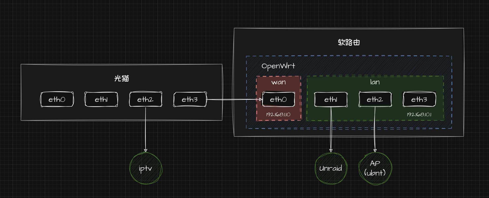

## 0. 引言

在日常的工作和生活之中，总有一些网络上的需求和问题需要解决。比如：

- 如何访问 GitHub？
- 如何在联机游戏中获得稳定的环境？
- 不在家中如何访问 Nas 中的资源？

解决这些问题的一个简单途径，既是在家中搭建一个功能丰富的软路由系统，实现各种高级的网络功能，同时也是后续置办 Nas，搭建私有云的基础。


## 1. 网络环境概述

### 1.1. 总体架构



### 1.2. 设备清单

1. 光猫：使用运营商提供的光猫，包含了 WiFi 的功能，保障软路由即使挂掉，依然有网络可以访问
2. 软路由：一台 x86 或者 arm 的机器，文中使用的是 N5105
3. AP 节点：用于扩展网络信号

### 1.3. 方案选择

将 OpenWrt 直接安装在软路由上，无疑可以获得最好的性能，但是此方案也存在一些弊端。如果在折腾 OpenWrt 系统的过程中出现某些异常，OpenWrt 无法访问，将影响全局的网络访问

为了可以随时折腾家中的网络，同时保证家人的网络访问不受影响，我们选择在 PVE 上安装 OpenWrt 系统


## 2. PVE 的安装与配置

### 2.1. PVE 系统安装

PVE 的安装可以参考 [PVE 官方文档](https://pve.proxmox.com/wiki/Installation)

### 2.2. PVE 开启硬件直通

为了获得更好的性能，可以在安装完成 PVE 后，开启硬件直通功能，将网卡直通给 OpenWrt 使用

**1. 启用 IOMMU**

在主机 BIOS 设置中启用 `VT-d`（对于Intel处理器）或 `AMD-Vi`（对于AMD处理器）功能。

修改GRUB配置文件（通常是 `/etc/default/grub`），添加或修改以下条目：

Intel 处理器添加以下内容：

```makefile
GRUB_CMDLINE_LINUX_DEFAULT="quiet intel_iommu=on"
```

AMD 处理器添加以下内容

```makefile
GRUB_CMDLINE_LINUX_DEFAULT="quiet intel_iommu=on"
```

**2. 更新 GRUB 配置**

运行 update-grub 命令来更新GRUB配置。

**3. 重启系统**

重启您的 PVE 系统以应用更改。使用以下命令可检查 IOMMU 是否激活：

```shell
dmesg | grep -e DMAR -e IOMMU
```


## 3. OpenWrt 的安装与配置

### 3.1. OpenWrt 镜像选择

OpenWrt 官方提供了构建好的镜像，可以直接用来安装。也可以选择一些第三方的镜像，通常这类镜像已经内置了很多常用的软件包，可以减少后续的配置工作。这里使用的是 https://github.com/stupidloud/nanopi-openwrt/releases 。

### 3.2. OpenWrt 安装

在 PVE 上安装 OpenWrt 有以下几个步骤：

**1. 上传镜像**

上传镜像到 PVE 的本地存储，依次选择的 local(pve) -> ISO 镜像 -> 上传

**2. 创建虚拟机**

选择刚刚上传的镜像，设置虚拟机的 CPU、内存、硬盘等参数。一般的机器性能都是过剩的，由于我并不打算在软路由中实现更多的功能，因此我使用的是 1C2G 的组合

### 3.3. 网络接口配置

**1. WAN 口配置**

将软路由器与光猫连接的接口设为 WAN 口，为了方便访问，可以将 WAN 口设置为静态 IP，如 `192.168.1.10`。

**2. LAN 口配置**

将软路由器上其他的接口使用桥接模式，设置为 LAN 口，作为内网的网关，使用静态 IP 模式，设置为 `192.168.10.1`。配置完成后，将 AP 节点接入 LAN，即可实现网络访问

### 3.3. 其他功能

可以根据自己的需求和使用的 OpenWrt 版本，自行安装或启用其他的高级功能，如广告过滤、游戏加速等等