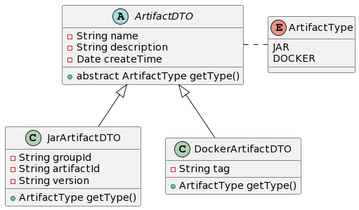
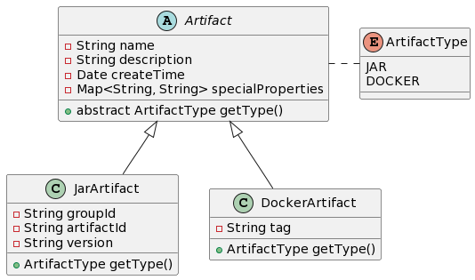

## 1. 引言

### 1.1. 需求

最近在开发一个基于 Spring Boot 框架的制品管理平台，使用了**领域驱动设计**的思想进行了业务模型的设计。

开发过程中遇到了一个常见的需求：**创建不同类型的制品（Artifact）**。需求概括如下：

1. 不同的构建任务会生成不同类型的制品，如 Jar 包、Dockers 镜像等；
2. 所有类型的制品具备一些公共的属性，如名称、描述、创建时间等；
3. 不同类型的制品存在一些独有的属性，如存储位置、是否关联图片等；
4. 制品的独有属性用于创建后，触发下游的其他任务。

对于 CRUD Boys 来说，是一个十分常见的需求，最简单的实现方式就是使用贫血模型。

### 1.2. 贫血模型

贫血模型由 Martin Fowler 在 2003 年提出，是一种将数据和行为分离的设计模式。

在贫血模型中，Controller 层接受不同类型制品的创建请求（DTO），Service 层负责将请求映射为持久化对象（PO），DAO 层负责将持久化对象存储到数据库中。

对于大多数 CRUD 请求来说，贫血模型可以说是一套“万能公式”，支撑起了无数的 Java 服务。但是，贫血模型也有着一些明显的缺点：

1. 模型不能反馈业务逻辑，开发人员无法深入地理解业务；
2. 大部分的 CRUD 逻辑存在相似性，代码复用性较差；
3. 一旦新增了业务逻辑，此处为制品类型，需要新增接口和表结构，维护成本较高。
4. 现有流程增加业务逻辑时，需要修改所有的流程，重复工作量较大。

### 1.3. 基于可复用性的设计

**DRY 原则（Don't Repeat Yourself）**是软件工程中的一条重要原则，它要求系统减少重复，提高代码的可复用性。

为了做到这一点，首先需要的是对已有的需求进行更高层次的抽象，既要将相似的业务逻辑进行整合，也要让每种类型能够管理自己的特殊属性。其次，适当的引入设计模型也可以简化代码的复杂度，提高代码的可维护性。

## 2. 需求分析

### 2.1. 需求建模

让我们回顾一下需求，找到其中的共性和差异性：

1. 共性
    1. 所有类型的制品都有名称、描述、创建时间等属性；
    2. 制品可以使用相同的逻辑进行处理、存储；
    3. 制品的独有属性都是用于触发下游任务。
2. 差异性
    1. 不同类型的制品有着不同的特殊属性。

因此，我们首先对创建请求进行抽象，对于 Jar 包和 Docker 镜像类制品，可以创建如下 DTO 类：

```java
public abstract class ArtifactDTO {
    protected String name;
    protected String description;
    protected Date createTime;

    public abstract ArtifactType getType();
}

public enum ArtifactType {
    JAR,
    DOCKER;
}

public class JarArtifactDTO extends ArtifactDTO {
    private String groupId;
    private String artifactId;
    private String version;

    @Override
    public ArtifactType getType() {
        return ArtifactType.JAR;
    }
}

public class DockerArtifactDTO extends ArtifactDTO {
    private String tag;

    @Override
    public ArtifactType getType() {
        return ArtifactType.DOCKER;
    }
}
```

DTO 对象如下图所示：



考虑使用 DDD 的设计思想，我们还需要对领域对象进行建模，首先是父类 `Artifact`：

```java
public abstract class Artifact {
    protected String name;
    protected String description;
    protected Date createTime;
    // 保存特殊属性，用于触发下游任务
    protected Map<String, String> specialProperties;

    public abstract ArtifactType getType();
}
```

其次，针对每一个特殊的制品类型，创建一个子类：

```java
public class JarArtifact extends Artifact {
    private String groupId;
    private String artifactId;
    private String version;

    @Override
    public ArtifactType getType() {
        return ArtifactType.JAR;
    }
}

public class DockerArtifact extends Artifact {
    private String tag;

    @Override
    public ArtifactType getType() {
        return ArtifactType.DOCKER;
    }
}
```

领域对象如下图所示：



### 2.2. 需求简化

对 DTO 和 Entity 建模后，可以发现制品的创建过程可以被简化为：

1. 根据 DTO 的类型创建对应的 Entity；
2. 填充 DTO 的共有属性；
3. 处理不同类型 DTO 的独有属性。

### 2.3. 模式选择

在我们的项目中，使用 `DTO` 表示前端传递的数据，使用 `Entity` 表示领域模型。每个请求都会经过下述的流程：

1. Controller 层接收 DTO；
2. Service 层根据 DTO 的内容创建 Entity；
3. 处理业务逻辑。

对于这种情况，我们可以使用**工厂方法模式**和**抽象工厂模式**来实现。工厂方法模式用于根据 DTO 的类型不同，实现不同种类 Entity 的初始化逻辑；抽象工厂用于根据 DTO 的类型不同，选择不同的工厂方法。

如果对象的初始化较为复杂，还可以使用**构建器模式**来构建对象。

## 3. 代码实现

### 3.1. 工厂方法

首先，我们需要定义一个工厂接口，用于创建不同类型的制品：

```java
public interface ArtifactFactory<T extends ArtifactDTO> {

    /**
     * 获取工厂对应的制品类型，用于抽象工厂的选择
     *
     * @return 制品类型
     */
    ArtifactType getArtifactType();

    /**
     * 根据 DTO 类型创建对应的制品
     *
     * @param dto 创建制品 DTO
     * @return 制品
     */
    Artifact createEmptyArtifact();

    /**
     * 获取制品的特殊属性
     *
     * @param dto 创建制品 DTO
     * @return 特殊属性
     */
    Map<String, String> getSpecialProperties(T dto);

    /**
     * 创建制品
     *
     * @param dto 创建制品 DTO
     * @return 制品
     */
    default Artifact createSubArtifact(T dto) {
        Artifact artifact = createEmptyArtifact(dto);
        artifact.setName(dto.getName());
        artifact.setDescription(dto.getDescription());
        artifact.setCreateTime(dto.getCreateTime());
        artifact.setSpecialProperties(getSpecialProperties(dto));
        return artifact;
    }

    default Artifact createArtifact(ArtifactDTO dto) {
        if (dto.getType() != getArtifactType()) {
            throw new IllegalArgumentException("Unsupported artifact type: " + dto.getType());
        }
        return createSubArtifact((T) dto);
    }
}
```

在工厂方法中，有以下几点需要注意：

1. 为了简化代码，我们提供了一个默认实现 `createSubArtifact` 方法，用于创建制品、填充共有属性和处理特殊属性；
2. 我们希望 DTO 到 Entity 的代码可以复用，因此用泛型 `T` 表示 DTO 类型；
3. 由于 Java 的泛型擦除机制，我们需要在 `createArtifact` 方法中进行类型转换，同时在此方法中进行了类型检查。

然后，我们需要为每种类型的制品创建一个具体的工厂类：

```java
@Component
public class JarArtifactFactory implements ArtifactFactory<JarArtifactDTO> {
    @Override
    public Artifact createEmptyArtifact() {
        return new JarArtifact();
    }

    @Override
    public Map<String, String> getSpecialProperties(JarArtifactDTO dto) {
        Map<String, String> specialProperties = new HashMap<>();
        specialProperties.put("groupId", dto.getGroupId());
        specialProperties.put("artifactId", dto.getArtifactId());
        specialProperties.put("version", dto.getVersion());
        return specialProperties;
    }
}

@Component
public class DockerArtifactFactory implements ArtifactFactory<DockerArtifact> {
    @Override
    public Artifact createEmptyArtifact() {
        return new DockerArtifact();
    }

    @Override
    public Map<String, String> getSpecialProperties(DockerArtifact dto) {
        Map<String, String> specialProperties = new HashMap<>();
        specialProperties.put("tag", dto.getTag());
        return specialProperties;
    }
}
```

将每一个工厂类标记为 `@Component`，可以让 Spring Boot 自动扫描并注册到容器中。

### 3.2. 抽象工厂

工厂方法创建好后，我们还期望可以根据 DTO 的类型自动选择对应的工厂。

考虑在 Spring 中可以使用 `@Autowired` 注解来自动注入所有的工厂 Bean，我们可以提供制品类型到工厂的映射：

```java
@Component
public class ArtifactFactoryRegistry {

    private final Map<ArtifactType, ArtifactFactory> factoryMap;

    /**
     * 构造函数，使用 Spring 自动注入所有的工厂列表
     *
     * @param factories 工厂列表
     */
    @Autowired
    public ArtifactFactoryRegistry(List<ArtifactFactory> factories) {
        factoryMap = factories.stream()
                .collect(Collectors.toMap(ArtifactFactory::getArtifactType, Function.identity()));
    }

    /**
     * 根据 DTO 类型创建对应的制品
     *
     * @param dto 创建制品 DTO
     * @return 制品
     */
    public Artifact createArtifact(ArtifactDTO dto) {
        ArtifactFactory factory = factoryMap.get(dto.getType());
        if (factory == null) {
            throw new IllegalArgumentException("Unsupported artifact type: " + dto.getType());
        }
        return factory.createArtifact(dto);
    }
}
```

### 3.3. 使用

在 Service 层中，我们可以直接使用 `ArtifactFactoryRegistry` 来创建制品：

```java
@Service
public class ArtifactService {

    private final ArtifactFactoryRegistry factoryRegistry;

    @Autowired
    public ArtifactService(ArtifactFactoryRegistry factoryRegistry) {
        this.factoryRegistry = factoryRegistry;
    }

    public void createArtifact(ArtifactDTO dto) {
        Artifact artifact = factoryRegistry.createArtifact(dto);
        // ... 省略其他业务逻辑
    }
}
```

## 4. 优势

通过引入抽象工厂和工厂方法模式，我们可以获得以下优势：

1. 易扩展：新增一个制品类型，只需要新增一个工厂类，Service 层的代码完全不需要修改；
2. 好维护：不同类型的制品使用不同的工厂，代码逻辑清晰，易于维护。

## 5. 后续优化

### 5.1. 接口可以合并

在示例代码中仅提供了 Service 的使用，在我们目前的视线中，Controller 层还是为一个类型的制品单独提供了创建的接口，后续计划使用 Jackson 的反序列化特性，将所有的制品类型统一为一个接口。

## 6. 结论

DRY 原则是软件工程中的一条重要原则，它要求系统减少重复，提高代码的可复用性。

通过对需求深度分析，提供更高阶别的抽象，可以帮助找到系统中的共性和差异，提升代码的复用性。

通过引入设计模式，可以进一步简化代码的复杂度，提高代码的可维护性，有助于后续的扩展。

将复杂的问题化繁为简，在一层层的抽丝剥茧后，找到最简洁的设计并予以实现，这正是软件开发的乐趣所在。

## 7. 参考

1. [Martin Fowler: AnemicDomainModel](https://martinfowler.com/bliki/AnemicDomainModel.html)
2. [Abstract Factory Pattern](https://refactoring.guru/design-patterns/abstract-factory)
3. [Factory Method Pattern](https://refactoring.guru/design-patterns/factory-method)